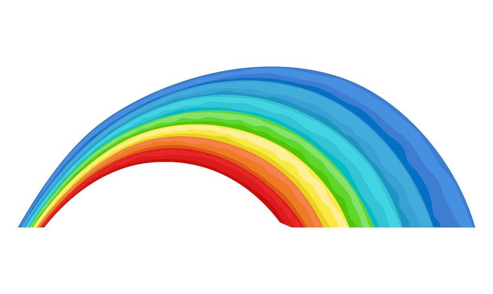

# Seabow介绍
Seabow是一套基于spring boot2.0的一套快速开发框架，致力于集成了一系列最佳实践，使开发人员能够基于seabow快速的开发项目，不用过多的把精力用于搭建开发框架，只需要编写自己的业务逻辑即可。

Seabow是前后端分离的项目，前端采用Vuejs+Element.服务端为基于spring boot2.0的webapi

# Seabow主要集成了以下技术和工具
## 前端
* Vue
* Vuex
* Webpack
* Sass/Less
* Element
* Axios

## 服务端
* Spring boot2.0
* MyBatis
* Log4j2
* Harika
* Interceptor
* Restful
* lombok
* Swagger2

# Seabow框架已实现了以下特性：

* 统一的异常处理
* 数据有效性验证
* 日志记录，自动记录各层的参数和返回值，请求处理时间
* 模块化开发
* Unit Of Work工作单元模式
* 自动生成接口文档

